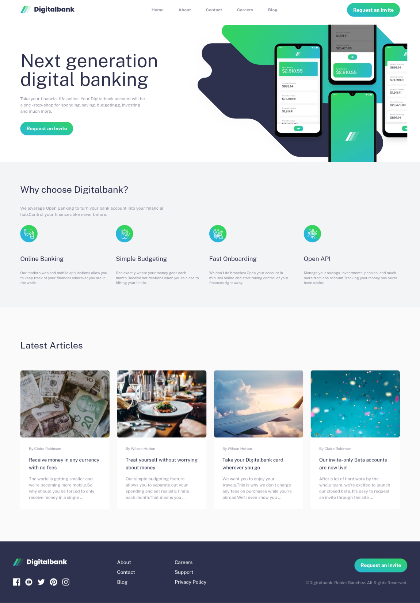

# Frontend Mentor - Digitalbank landing page solution

This is a solution to the [Digitalbank landing page challenge on Frontend Mentor](https://www.frontendmentor.io/challenges/digital-bank-landing-page-WaUhkoDN). Frontend Mentor challenges help you improve your coding skills by building realistic projects.

## Table of contents

- [Overview](#overview)
  - [The challenge](#the-challenge)
  - [Screenshot](#screenshot)
  - [Links](#links)
- [My process](#my-process)
  - [Built with](#built-with)
  - [What I learned](#what-i-learned)
- [Author](#author)

**Note: Delete this note and update the table of contents based on what sections you keep.**

## Overview

### The challenge

Users should be able to:

- View the optimal layout for the site depending on their device's screen size.
- Have the theme adjust to whatever the user's device theme is (e.g. Dark and Light mode).

### Screenshot

### Links

- [Solution URL here](https://www.frontendmentor.io/solutions/digital-bank-landing-page-made-in-next-js-s_PX3gN4Bp)
- [Live site URL here](https://fm-digital-bank.vercel.app/)

## My process

### Built with

- Tailwind CSS
- [React](https://reactjs.org/) - JS library
- [Next.js](https://nextjs.org/) - React framework
- Mobile-first workflow

### What I learned

- I learned from this project the importance of breaking down the project into bite size chunks in order to successfully finish the project. 

## Author

- Frontend Mentor - [@Alyssandria](https://www.frontendmentor.io/profile/Alyssandria/solutions)

**Note: Delete this note and add/remove/edit lines above based on what links you'd like to share.**

